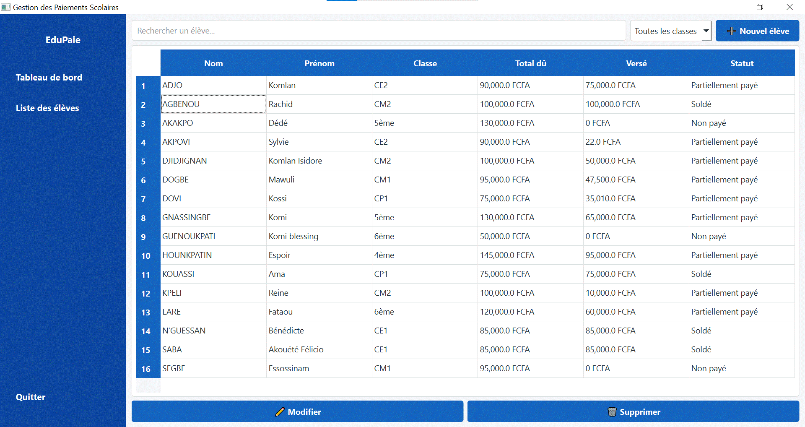
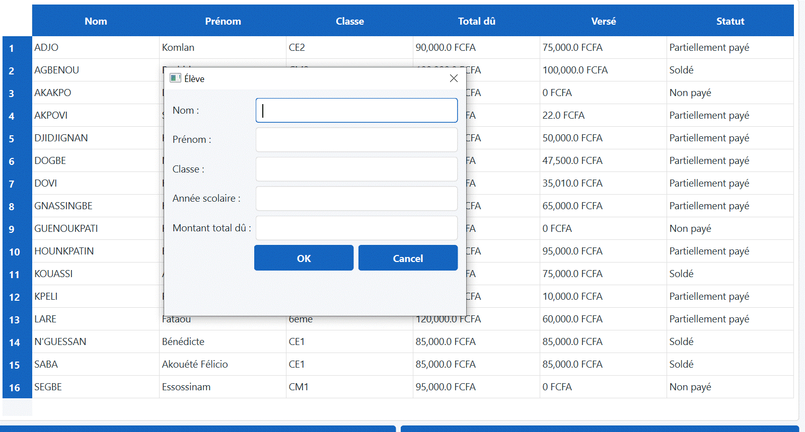
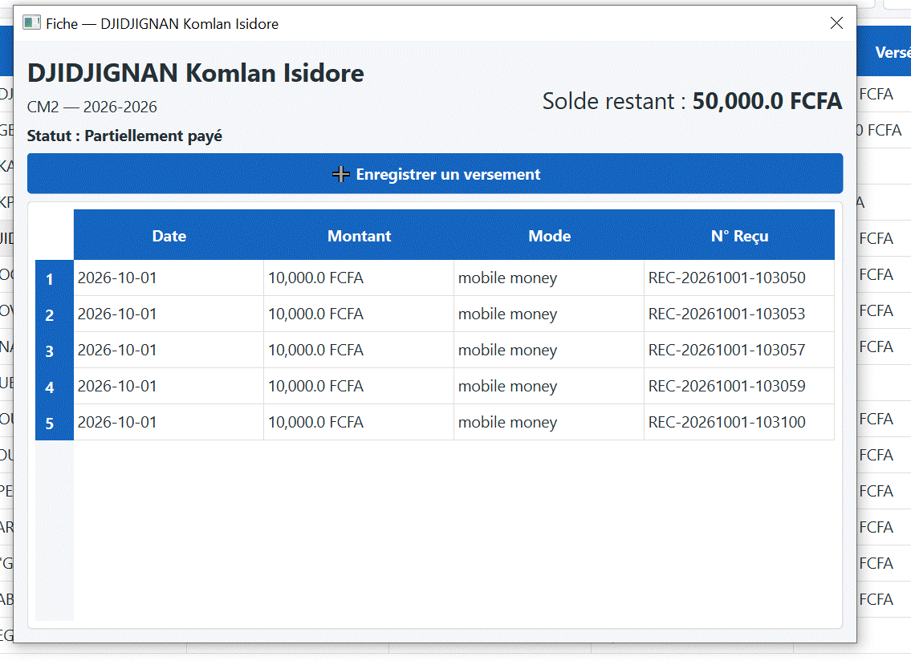
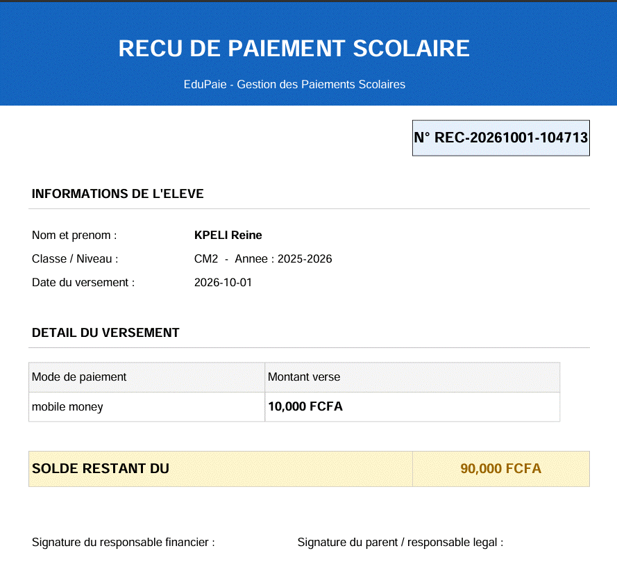
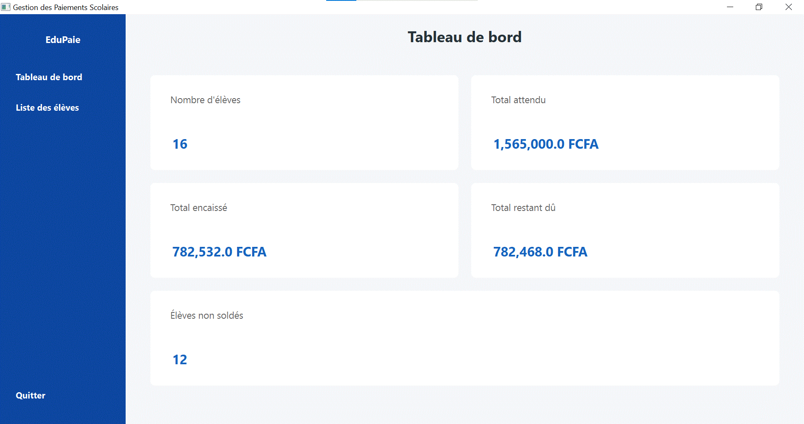

---

# 📄 DOCUMENTATION COMPLÈTE — Gestion des Paiements Scolaires

**Auteur :** SABA Akouété Félicio
**Date :** 01/10/2026
**Version :** 1.0

---

## 1. PRÉSENTATION DU PROJET

### 1.1 Contexte
De nombreuses écoles et centres de formation utilisent encore des cahiers de caisse ou des fichiers Excel pour suivre les paiements des élèves. Cela entraîne :
- Des calculs manuels sujets aux erreurs
- L'absence de vue en temps réel sur les soldes
- La difficulté de produire un reçu fiable rapidement

### 1.2 Objectif
Développer une application de bureau permettant de :
- Gérer la liste des élèves
- Enregistrer les paiements au fur et à mesure
- Calculer automatiquement le solde restant
- Générer un reçu PDF numéroté à chaque versement
- Fournir un tableau de bord synthétique

### 1.3 Périmètre
- Application mono-utilisateur pour usage local
- Système d'exploitation cible : Windows
- Pas de connexion réseau ni synchronisation

---

## 2. ARCHITECTURE RETENUE

### 2.1 Schéma des couches

```
┌─────────────────────────────────────────────────────┐
│              COUCHE PRÉSENTATION                    │
│  ─ Fenêtre principale / Menu latéral               │
│  ─ Liste des élèves avec recherche et filtre        │
│  ─ Formulaire élève / Dialogue de paiement           │
│  ─ Fiche élève + Historique                         │
│  ─ Tableau de bord                                  │
│  Technologie : PySide6 / QSS pour le style          │
└──────────────────────┬──────────────────────────────┘
                       │
┌──────────────────────▼──────────────────────────────┐
│              COUCHE MÉTIER                          │
│  ─ Règles de calcul du solde                        │
│  ─ Détermination du statut (Soldé / Partiel / Non)  │
│  ─ Validation du paiement (solde ≥ 0)               │
│  ─ Génération du numéro de reçu unique              │
│  ─ Création du reçu PDF                             │
│  Fichiers : business/services.py, business/recu_pdf.py │
└──────────────────────┬──────────────────────────────┘
                       │
┌──────────────────────▼──────────────────────────────┐
│              COUCHE DONNÉES                         │
│  ─ Connexion et création des tables SQLite          │
│  ─ Requêtes SQL : CRUD Élèves / Paiements           │
│  ─ Jeu de données de test                           │
│  Fichiers : data/database.py, data/repositories.py  │
└─────────────────────────────────────────────────────┘
```

### 2.2 Principe de séparation
- **Aucune requête SQL dans l'interface** → tout passe par `repositories.py`
- **Aucun calcul métier dans l'interface** → tout est dans `services.py`
- L'UI ne fait qu'afficher et transmettre les actions de l'utilisateur

### 2.3 Structure des dossiers
| Dossier | Rôle |
|---|---|
| `data/` | Accès base de données, schéma, requêtes |
| `business/` | Logique, calculs, génération PDF |
| `ui/` | Fenêtres, formulaires, composants graphiques |
| `docs/` | Documentation, schémas, guides, captures |
| `resources/` | Feuille de style QSS, images, logos |

---

## 3. CHOIX TECHNIQUES JUSTIFIÉS

| Choix | Justification |
|---|---|
| **Python 3.10+** | Lisibilité, multiplateforme, bibliothèques riches, recommandé en formation |
| **PySide6** | Composants natifs complets, maintenu, stylisation QSS, exigé dans le cahier des charges |
| **SQLite** | Autonome (un seul fichier), intégré dans Python, adapté à une application locale, maîtrise directe du SQL |
| **fpdf2** | Léger, contrôle précis de la mise en forme du reçu PDF |
| **PyInstaller** | Création d'un exécutable autonome — fonctionne sans Python installé sur la machine |
| **Architecture 3 couches** | Séparation claire des responsabilités → maintenance et évolution facilitées |

---

## 4. PRÉSENTATION DES ÉCRANS — Captures et Justifications

### 4.1 Fenêtre principale — Liste des élèves

<p align="center">
  
</p>

**Justification :**
- **Vue d'ensemble immédiate** : l'utilisateur voit tous les élèves et leur situation en un seul coup d'œil
- **Recherche et filtre** : permettent de trouver rapidement un élève même dans une liste longue
- **Statut coloré** : repérage instantané — Soldé / Partiellement payé / Non payé
- **Actions directes** : boutons "Nouvel élève", "Modifier", "Supprimer" accessibles sans détour
- **Charte graphique** : bandeau latéral bleu cohérent, lisibilité optimisée
- **Devise FCFA** : adaptée au contexte d'usage local

---

### 4.2 Formulaire d'ajout / modification d'élève

<p align="center">
  
</p>

**Justification :**
- **Champs complets** : identité, classe, année scolaire et montant des frais — toutes les informations essentielles
- **Focus automatique** : curseur positionné sur le premier champ → saisie plus rapide
- **Boutons clairs** : OK pour valider / Cancel pour annuler — même charte graphique
- **Fenêtre modale** : la liste reste visible en arrière-plan pour garder le contexte
- **Validation en temps réel** : champs obligatoires vérifiés avant enregistrement

---

### 4.3 Fiche élève — Solde et Historique des paiements

<p align="center">
  
</p>

**Justification :**
- **Synthèse en évidence** : solde restant affiché en grand — la question la plus fréquente des parents est répondue immédiatement
- **Statut explicite** : "Partiellement payé" / "Soldé" / "Non payé" — pas d'ambiguïté
- **Historique chronologique** : chaque versement daté, détaillé, avec son mode de paiement
- **Numéro de reçu unique** : format `REC-AAAAMMJJ-HHMMSS` garantit la traçabilité et l'unicité
- **Action directe** : bouton "Enregistrer un versement" pour ajouter un paiement sans quitter la fiche

---

### 4.4 Reçu de paiement PDF — Impression

<p align="center">
  
</p>

**Justification :**
- **En-tête professionnel** : identité de l'établissement, numéro unique du reçu
- **Complétude** : nom de l'élève, classe, date, mode de paiement, montant versé
- **Information clé** : solde restant dû rappelé — transparent pour la famille
- **Emplacements signatures** : responsable financier et parent — document valide juridiquement
- **Format réutilisable** : ré-impression possible à tout moment depuis l'historique
- **Mise en page A4** : adaptée à l'impression papier sans ajustement

---

### 4.5 Tableau de bord — Synthèse globale

<p align="center">
  
</p>


**Justification :**
- **Indicateurs essentiels** : nombre d'élèves, total attendu, total encaissé, reste à percevoir
- **Vue financière** : permet à la direction d'avoir une vision globale en temps réel
- **Suivi des relances** : "Élèves non soldés" — indique combien de familles doivent encore des versements
- **Présentation épurée** : cartes distinctes, chiffres mis en valeur, lecture facilitée
- **Accessibilité** : page d'accueil par défaut — la secrétaire voit la situation dès l'ouverture

---

## 5. RÈGLES MÉTIER ET MODÉLISATION

### 5.1 Calcul du solde
```
solde_restant = montant_total_du - somme_de_tous_les_paiements
```

### 5.2 Détermination du statut
| Situation | Statut |
|---|---|
| somme_de_paiements = 0 | **Non payé** |
| somme_de_paiements > 0 ET solde_restant > 0 | **Partiellement payé** |
| solde_restant = 0 | **Soldé** |

### 5.3 Contraintes de paiement
- Montant versé > 0
- Montant versé ≤ solde_restant (sinon : refus + message d'avertissement)
- Numéro de reçu unique : `REC-AAAAMMJJ-HHMMSS-XXX`

### 5.4 Schéma de la base
```
eleve (id_eleve PK, nom, prenom, classe, annee_scolaire, montant_total_du)
paiement (id_paiement PK, id_eleve FK, montant_verse, mode_paiement,
          date_paiement, numero_recu UNIQUE)
```
- Suppression d'un élève → suppression en cascade de ses paiements
- Index sur `classe` et `id_eleve` pour la rapidité des recherches

---

## 6. LIMITES CONNUES ET PISTES D'ÉVOLUTION

### 6.1 Limites actuelles
| Limite | Description |
|---|---|
| Mono-utilisateur | Pas de gestion des accès simultanés ; deux ouvertures écrasent les modifications |
| Pas de sauvegarde automatique | La base doit être copiée manuellement |
| Pas de synchronisation | Les données restent sur une seule machine |
| Pas de gestion des utilisateurs | Pas de connexion / mot de passe / droits d'accès |
| Taille de l'exécutable | ~60 Mo — dû à l'inclusion complète de Python et PySide6 |

### 6.2 Pistes d'amélioration
- Ajouter une sauvegarde périodique automatique de la base
- Gérer plusieurs utilisateurs avec rôles (secrétaire, directeur, comptable)
- Ajouter des statistiques graphiques (taux de recouvrement par classe)
- Exporter la liste des élèves et paiements vers Excel/CSV
- Envoyer le reçu par email directement depuis l'application
- Mise en réseau de la base (PostgreSQL/MySQL) pour accès distant

---

## 7. CONCLUSION

Ce projet a permis de passer d'un besoin concret — le suivi manuel des paiements — à une solution logicielle complète, structurée et opérationnelle. La séparation en trois couches facilite la maintenance et l'évolution du code. L'application est prête à être utilisée et distribuée sous forme d'exécutable autonome.

La réalisation pas à pas, de la modélisation à l'empaquetage, a permis de mettre en œuvre les principes de développement structuré et de respecter l'ensemble des exigences du cahier des charges.

---

**Fin de la documentation**